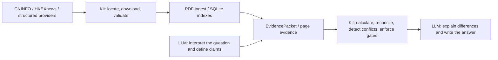

# ah-disclosure-kit — A/H-share filing analysis with Python and MCP

**English** | [Simplified Chinese](./README.zh-CN.md)

[](https://github.com/hc938456/ah-disclosure-kit/actions/workflows/ci.yml)
[](https://github.com/hc938456/ah-disclosure-kit/releases/latest)
[](https://www.python.org/)
[](./LICENSE)

A local Python and MCP toolkit for A-share and H-share disclosures. It retrieves structured company data, locates and downloads annual reports, announcements, and prospectuses, ingests PDFs into a searchable local index, and supplies traceable evidence and verified calculations for AI-assisted financial analysis.

> Current release: [`v1.1.2`](https://github.com/hc938456/ah-disclosure-kit/releases/tag/v1.1.2)
>
> This is not a market-data or trading-decision system. It does not provide real-time quotes, charts, order books, market timing, or investment advice.

## What it does

| Capability | Description |
|---|---|
| A/H company data | Profiles, business information, financial statements, indicators, dividends, shareholders, capital actions, and governance/ESG |
| Official filing sources | CNINFO-first for A-shares and HKEXnews-first for H-shares |
| Annual reports and prospectuses | Source discovery, download, completeness checks, and company/code/year identity validation |
| PDF ingest | Produces `meta.json`, `pages.jsonl`, `quality_report.json`, and SQLite indexes |
| Local retrieval | SQLite FTS, Chinese substring recall, and accounting-policy or financial-analysis strategies |
| Advanced financial analysis | Cash flow, financing, ETR, working capital, management reclassification, DuPont, ROIC, equity incentives, and cross-document tie-outs |
| Evidence gates | Preserves document IDs, pages, periods, units, and scope while detecting gaps, conflicts, and failed calculations |
| Batch preparation | CSV, JSON, or JSONL download/validate/ingest workflows with caching, controlled concurrency, and resume support |

## How it works



Responsibility boundary:

- **LLM** interprets flexible questions, defines claims and accounting scope, reviews evidence, explains differences, and writes the answer.
- **Kit** locates filings, validates identity, ingests and indexes pages, retrieves bounded evidence, performs deterministic calculations, detects conflicts, and blocks unsupported completion.

## Quick install

### Option 1: full Kit + Skill package (recommended)

Download this asset from the [latest release](https://github.com/hc938456/ah-disclosure-kit/releases/latest):

```text
ah-disclosure-kit-v1.1.2.zip
```

Extract it to a stable directory and open Windows PowerShell in the extracted project directory:

```powershell
Set-Location "C:\path\to\ah-disclosure-kit-v1.1.2"
```

For isolation from other Python tools, optionally create and activate a dedicated virtual environment before running the installer:

```powershell
python -m venv .venv
.\.venv\Scripts\Activate.ps1
```

Then run the installer:

```powershell
Set-ExecutionPolicy -Scope Process Bypass
$SkillRoot = Join-Path $env:USERPROFILE ".agents\skills"
.\scripts\INSTALL_AND_CHECK.ps1 -SkillInstallRoot $SkillRoot
```

The installer:

- checks for Python 3.11 or later;
- upgrades `pip` in the environment selected by `python`;
- installs the `pdf,company-data,mcp` extras into the environment selected by `python`;
- prepares the default data directory;
- replaces any existing same-name target and copies the complete Skill to the selected Skill root;
- registers the MCP server when the Claude CLI is available;
- verifies the package version and `server-info`.

The installer does not install Python, does not install the system-level Tesseract executable, and does not create a `.venv`. If you skip the optional virtual-environment step, it modifies the Python environment currently selected by `python`. It uses an editable installation, so keep the extracted source directory in place. If you move it, rerun the installer.

The explicit `-SkillInstallRoot` makes the intended Skill scope visible. The installer also uses `%USERPROFILE%\.agents\skills` as its default.

### Option 2: install from source

```powershell
git clone https://github.com/hc938456/ah-disclosure-kit.git
cd ah-disclosure-kit
python -m pip install -e ".[pdf,company-data,mcp]"
```

The wheel and source distribution in the release install the Python backend. Use the full ZIP or source checkout when you also need the Skill, installer, examples, and complete documentation.

## Skill and MCP setup

### User-level Codex Skill

The recommended user-level location is:

```text
%USERPROFILE%\.agents\skills\ah-disclosure
```

### Project-level Codex Skill

To make the Skill discoverable only within one project:

```powershell
.\scripts\INSTALL_AND_CHECK.ps1 `
  -SkillInstallRoot "C:\path\to\project\.agents\skills"
```

Copy the entire `skills/ah-disclosure` directory, not only `SKILL.md`. The Skill also requires `agents/openai.yaml` and the four workflow references.

### Codex MCP configuration

First locate the Python executable used for installation:

```powershell
python -c "import sys; print(sys.executable)"
```

Add the following to `%USERPROFILE%\.codex\config.toml`:

```toml
[mcp_servers.ah_disclosure]
command = 'C:\path\to\python.exe'
args = ["-m", "ah_disclosure.mcp_server"]
startup_timeout_sec = 120
```

The Codex MCP key is `ah_disclosure`, matching the dependency declared by the Skill. Restart Codex after changing MCP or Skill configuration.

### Claude Code

The installer attempts automatic registration when `claude` is on `PATH`. You can also register it manually:

```powershell
claude mcp add --transport stdio --scope user ah-disclosure "python -m ah_disclosure.mcp_server"
```

Other clients that support local stdio MCP servers can use:

```text
python -m ah_disclosure.mcp_server
```

## Verify the installation

```powershell
python -m ah_disclosure.cli --version
python -m ah_disclosure.cli server-info
codex mcp list
```

Expected version:

```text
1.1.2
```

Treat the `data_dir` returned by `server-info` as authoritative. Do not infer it from the shell's current working directory.

After restarting Codex:

- open MCP status with `/mcp` and confirm `ah_disclosure` is connected;
- open the Skills view or use `/skills` where supported and confirm `ah-disclosure` is listed;
- start a new task with `$ah-disclosure` and ask for `server-info`.

The default public-disclosure workflows do not require an API key. They do require network access to the relevant public sources. Without the system-level Tesseract executable, text-native PDFs still work, but scan-only pages cannot be OCRed and may fail ingest quality checks.

## Example questions

After installing both the Skill and MCP server, ask your LLM:

- "Download Zijin Mining's 2025 H-share annual report. Do not ingest it."
- "Download and ingest this prospectus, then explain its revenue-recognition models with page evidence."
- "Analyze operating cash flow and test whether the indirect-method bridge ties out."
- "Derive the effective tax rate and reconcile the complete rate bridge to income-tax expense."
- "Convert the balance sheet into a management-analysis format and calculate working capital, NOA, NFO, and capital employed."
- "Reconcile actual financing cash flows across borrowings, interest, leases, and financing activities."
- "Compare the same metric across A-share and H-share reports and identify differences in scope, units, and period."

Batch preparation:

```powershell
ah-disclosure batch prepare `
  --input examples\batch.example.csv `
  --output batch_result.json `
  --summary-only
```

The batch command only discovers, downloads, validates, and ingests filings. It does not automatically produce financial-analysis conclusions.

## Important behavior

- A URL-only or download-only request does not trigger ingest.
- Reading, retrieval, extraction, or analysis requests can trigger ingest and indexing.
- Default ingest outputs are `meta.json`, `pages.jsonl`, `quality_report.json`, and SQLite indexes.
- `document.md`, `full_text.txt`, and local embeddings are not generated by default.
- `ocr="auto"` uses OCR only for scan-like pages and only when it improves text quality.
- Search hits are candidate evidence until page, table headers, units, scope, and comparative periods are reviewed.
- Amounts, ratios, and tie-outs should use Kit calculations instead of LLM mental arithmetic.
- Audit with dry-run before cleaning PDFs, parsed artifacts, or indexes; do not manually delete only one storage layer.

## Data directory and privacy

Source checkouts and editable installations use a workspace data directory; wheel installations use the operating system's user data directory. You can override either behavior:

```powershell
$env:AH_DISCLOSURE_DATA_DIR="C:\path\to\data\ah_disclosure"
```

Typical local data:

```text
raw/        original PDFs
parsed/     pages.jsonl and related parsed artifacts
index/      SQLite indexes
cache/      source and identity caches
staging/    download, extraction, OCR, and manual-review staging
```

The repository's `.gitignore` excludes PDFs, SQLite databases, JSONL files, caches, logs, `.env`, and local configuration. Still review staged files before publishing or pushing changes.

## Repository layout

```text
ah-disclosure-kit/
├─ src/ah_disclosure/       Python backend and MCP server
├─ skills/ah-disclosure/    canonical Skill package
├─ scripts/                 installer and acceptance scripts
├─ docs/                    complete English documentation
├─ examples/                batch input and usage examples
├─ tests/                   automated tests
├─ pyproject.toml           package metadata and optional dependencies
├─ README.md                English GitHub landing page
└─ README.zh-CN.md          Simplified Chinese README
```

## Documentation

Documentation:

- [Documentation index](./docs/A0_DOC_INDEX.md)
- [Installation and usage](./docs/A1_INSTALLATION_AND_USAGE.md)
- [Updating a local installation](./docs/A2_UPDATE_LOCAL_INSTALL.md)
- [End-to-end workflow](./docs/A3_WORKFLOW.md)
- [MCP tool reference](./docs/A4_MCP_TOOLS.md)
- [PDF ingest](./docs/B1_PDF_INGEST.md)
- [Structured company data](./docs/B2_COMPANY_DATA.md)
- [HKEX](./docs/B3_HKEX.md)
- [Prospectuses](./docs/B4_PROSPECTUS.md)
- [Test plan](./docs/C1_TEST_PLAN.md)
- [Changelog](./CHANGELOG.md)

Skill workflow:

- [`skills/ah-disclosure/SKILL.md`](./skills/ah-disclosure/SKILL.md)
- [`Operations.md`](./skills/ah-disclosure/references/Operations.md)
- [`Analysis_Protocol.md`](./skills/ah-disclosure/references/Analysis_Protocol.md)
- [`Financial_Analysis.md`](./skills/ah-disclosure/references/Financial_Analysis.md)
- [`Troubleshooting.md`](./skills/ah-disclosure/references/Troubleshooting.md)

## Compatibility and validation

- Python 3.11, 3.12, 3.13, and 3.14;
- Windows and Linux GitHub Actions matrix;
- Ruff, Mypy, and 294 automated tests;
- full-extras installation, CLI/MCP smoke tests, and sdist/wheel builds.

The Python package and stdio MCP server can run on macOS/Linux, but the one-command installer and current operations guide are primarily designed for Windows PowerShell.

## Sources and license

This project uses public disclosure channels and the open-source Python ecosystem, including CNINFO, HKEXnews, AKShare, PyMuPDF, pypdf, SQLite, and MCP.

The project is available under the [MIT License](./LICENSE). Use of source data remains subject to each source website's terms.

## Release

- Latest stable version: [`v1.1.2`](https://github.com/hc938456/ah-disclosure-kit/releases/tag/v1.1.2)
- Full change history: [CHANGELOG.md](./CHANGELOG.md)
- Feedback and bug reports: [GitHub Issues](https://github.com/hc938456/ah-disclosure-kit/issues)

If this project is useful, please consider starring the repository.
