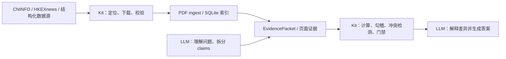

# ah-disclosure-kit

[English](./README.md) | **简体中文**

[](https://github.com/hc938456/ah-disclosure-kit/actions/workflows/ci.yml)
[](https://github.com/hc938456/ah-disclosure-kit/releases/latest)
[](https://www.python.org/)
[](./LICENSE)

面向 A 股和港股披露文件的本地 Python + MCP 工具包：查询公司资料，定位并下载年报、公告和招股书，解析 PDF，建立本地检索索引，并为 AI 财务分析提供可追溯证据和经过验证的计算。

**A/H-share disclosure documents, structured company data, HKEXnews/CNINFO PDF ingest, local search, and MCP tools for evidence-backed financial analysis.**

> 当前版本：[`v1.1.1`](https://github.com/hc938456/ah-disclosure-kit/releases/tag/v1.1.1)
>
> 这不是行情或交易决策系统，不提供实时行情、K 线、盘口、择时或投资建议。

## 核心能力

| 能力 | 说明 |
|---|---|
| A/H 股公司数据 | 公司概况、业务信息、财务报表、指标、分红、股东、资本行动及治理/ESG |
| 官方披露来源 | A 股优先使用 CNINFO，港股优先使用 HKEXnews |
| 年报与招股书 | 支持来源定位、下载、完整性校验、公司/代码/年度身份校验 |
| PDF ingest | 生成 `meta.json`、`pages.jsonl`、`quality_report.json` 和 SQLite 索引 |
| 本地检索 | SQLite FTS、中文子串召回、会计政策和财务分析检索策略 |
| 复杂财务分析 | 现金流、融资、ETR、营运资本、管理口径报表、DuPont、ROIC、股权激励及跨文档勾稽 |
| 证据门禁 | 保留文档 ID、页码、单位和期间；检测证据缺口、冲突与计算失败 |
| 批量准备 | CSV、JSON、JSONL 批量下载、校验和 ingest，支持缓存、并发和断点续跑 |

## 工作方式



职责边界：

- **LLM**：理解灵活问题，定义 claims、分析口径和证据要求，解释差异并撰写答案。
- **Kit**：定位文件、解析索引、提取证据、执行确定性计算、检测冲突并阻断不充分结论。

## 快速安装

### 方式一：完整 Kit + Skill（推荐）

从 [Latest Release](https://github.com/hc938456/ah-disclosure-kit/releases/latest) 下载：

```text
ah-disclosure-kit-v1.1.1.zip
```

解压到一个长期保留的目录，在 Windows PowerShell 中运行：

```powershell
Set-ExecutionPolicy -Scope Process Bypass
$SkillRoot = Join-Path $env:USERPROFILE ".agents\skills"
.\scripts\INSTALL_AND_CHECK.ps1 -SkillInstallRoot $SkillRoot
```

如需与其他 Python 工具隔离，建议先创建并启用独立虚拟环境：

```powershell
python -m venv .venv
.\.venv\Scripts\Activate.ps1
```

安装脚本会：

- 检查 Python 3.11+；
- 升级当前 `python` 对应环境中的 `pip`；
- 使用当前 `python` 对应的环境安装 `pdf,company-data,mcp` 依赖；
- 创建默认数据目录；
- 替换同名目标，并将完整 Skill 复制到指定的 Skill 根目录；
- 检测到 Claude CLI 时注册 MCP；
- 验证版本和 `server-info`。

安装脚本不会安装 Python、不会安装系统级 Tesseract，也不会自动创建 `.venv`。如果运行前没有启用虚拟环境，脚本会修改当前 `python` 指向的环境。它使用 editable installation，因此安装后不要删除或移动源码目录；如需移动，请重新运行安装脚本。

显式传入 `-SkillInstallRoot` 可以清楚指定 Skill 作用域；安装脚本的默认目录同样是 `%USERPROFILE%\.agents\skills`。

### 方式二：从源码安装

```powershell
git clone https://github.com/hc938456/ah-disclosure-kit.git
cd ah-disclosure-kit
python -m pip install -e ".[pdf,company-data,mcp]"
```

Release 中的 wheel 和 source distribution 用于安装 Python 后端。需要同时安装 Skill、脚本和完整文档时，请优先使用完整 ZIP 或源码仓库。

## Skill 与 MCP 接入

### Codex 用户级 Skill

推荐的用户级目录是：

```text
%USERPROFILE%\.agents\skills\ah-disclosure
```

### Codex 项目级 Skill

如果希望 Skill 只在某个项目中自动发现：

```powershell
.\scripts\INSTALL_AND_CHECK.ps1 `
  -SkillInstallRoot "C:\path\to\project\.agents\skills"
```

必须复制完整的 `skills/ah-disclosure` 目录，不能只复制 `SKILL.md`。该目录还包含 `agents/openai.yaml` 和四份工作流 reference。

### Codex MCP 配置

先查询实际 Python 路径：

```powershell
python -c "import sys; print(sys.executable)"
```

在 `%USERPROFILE%\.codex\config.toml` 中配置：

```toml
[mcp_servers.ah_disclosure]
command = 'C:\path\to\python.exe'
args = ["-m", "ah_disclosure.mcp_server"]
startup_timeout_sec = 120
```

Codex 配置键使用 `ah_disclosure`，与 Skill 声明的 MCP 依赖一致。修改 MCP 或 Skill 配置后请重启 Codex。

### Claude Code

安装脚本检测到 `claude` 命令时会尝试自动注册；也可以手工执行：

```powershell
claude mcp add --transport stdio --scope user ah-disclosure "python -m ah_disclosure.mcp_server"
```

其他支持本地 `stdio MCP` 的客户端可复用启动命令：

```text
python -m ah_disclosure.mcp_server
```

## 验证安装

```powershell
python -m ah_disclosure.cli --version
python -m ah_disclosure.cli server-info
codex mcp list
```

预期版本：

```text
1.1.1
```

`server-info` 返回的数据目录是运行时权威路径，不要根据启动命令所在目录猜测。

重启 Codex 后继续检查：

- 通过 `/mcp` 确认 `ah_disclosure` 已连接；
- 在 Skills 页面或支持 `/skills` 的界面确认 `ah-disclosure` 已被发现；
- 新建任务，显式使用 `$ah-disclosure` 并要求返回 `server-info`。

默认公开披露工作流不需要 API key，但需要能够访问相应公开数据源。未安装系统级 Tesseract 时，文本型 PDF 仍可正常处理；纯扫描页面无法 OCR，并可能无法通过 ingest 质量检查。

## 使用示例

安装 Skill 和 MCP 后，可以直接向 LLM 提问：

- “只下载紫金矿业港股 2025 年年报，不要 ingest。”
- “下载并解析这份招股书，告诉我收入确认模式和对应证据页。”
- “分析经营现金流，并用间接法检查现金流量表是否 tie out。”
- “推算 effective tax rate，完整勾稽税率调节项与所得税费用。”
- “把资产负债表转换为管理分析口径，计算 working capital、NOA、NFO 和 capital employed。”
- “分析实际融资现金收支，结合借款、利息、租赁和融资活动现金流进行勾稽。”
- “比较 A/H 两份报告中的同一指标，识别口径、单位和期间差异。”

批量准备示例：

```powershell
ah-disclosure batch prepare `
  --input examples\batch.example.csv `
  --output batch_result.json `
  --summary-only
```

批量命令只执行来源定位、下载、校验和 ingest，不自动生成财务分析结论。

## 关键行为

- 只要求链接或 PDF 下载时，不自动 ingest。
- 只有读取、检索、提取或分析请求才进入解析和索引流程。
- 默认 ingest 生成 `meta.json`、`pages.jsonl`、`quality_report.json` 和 SQLite 索引。
- 默认不生成 `document.md`、`full_text.txt` 或本地 embedding。
- OCR 默认使用 `auto`，仅在页面接近扫描件且 OCR 能改善质量时启用。
- 搜索命中只是候选证据；最终分析必须复核页码、表头、单位、期间和口径。
- 确定性金额、比例和 tie-out 应交给 Kit 计算，不依赖 LLM 心算。
- 清理 PDF、解析产物和索引前应先 dry-run 审计，不应手工删除单层文件。

## 数据目录与隐私

源码 checkout / editable installation 默认使用工作区数据目录；wheel installation 使用操作系统用户数据目录。也可以显式指定：

```powershell
$env:AH_DISCLOSURE_DATA_DIR="C:\path\to\data\ah_disclosure"
```

本地数据通常包括：

```text
raw/        原始 PDF
parsed/     pages.jsonl 等解析结果
index/      SQLite 索引
cache/      来源和身份缓存
staging/    下载、抽取、OCR 和人工复核暂存区
```

仓库通过 `.gitignore` 排除 PDF、SQLite、JSONL、缓存、日志、`.env` 和本地配置。发布前仍应自行确认没有把运行数据或凭据加入 Git。

## 项目目录

```text
ah-disclosure-kit/
├─ src/ah_disclosure/       Python 后端与 MCP server
├─ skills/ah-disclosure/    Skill 规范源
├─ scripts/                 安装及验收脚本
├─ docs/                    完整文档
├─ examples/                批量输入和调用示例
├─ tests/                   自动化测试
├─ pyproject.toml           Python 包与可选依赖
└─ README.md                GitHub 英文首页
```

中文版位于 `README.zh-CN.md`。

## 文档

- [文档索引](./docs/A0_DOC_INDEX.md)
- [安装与使用](./docs/A1_INSTALLATION_AND_USAGE.md)
- [本地更新](./docs/A2_UPDATE_LOCAL_INSTALL.md)
- [完整工作流](./docs/A3_WORKFLOW.md)
- [MCP 工具清单](./docs/A4_MCP_TOOLS.md)
- [PDF ingest](./docs/B1_PDF_INGEST.md)
- [公司结构化数据](./docs/B2_COMPANY_DATA.md)
- [HKEX](./docs/B3_HKEX.md)
- [招股书](./docs/B4_PROSPECTUS.md)
- [测试计划](./docs/C1_TEST_PLAN.md)
- [更新日志](./CHANGELOG.md)

Skill 工作流入口：

- [`skills/ah-disclosure/SKILL.md`](./skills/ah-disclosure/SKILL.md)
- [`Operations.md`](./skills/ah-disclosure/references/Operations.md)
- [`Analysis_Protocol.md`](./skills/ah-disclosure/references/Analysis_Protocol.md)
- [`Financial_Analysis.md`](./skills/ah-disclosure/references/Financial_Analysis.md)
- [`Troubleshooting.md`](./skills/ah-disclosure/references/Troubleshooting.md)

## 兼容性与验证

- Python 3.11、3.12、3.13、3.14；
- Windows 与 Linux GitHub Actions 测试矩阵；
- Ruff、Mypy、294 项自动化测试；
- 完整 extras 安装、CLI/MCP smoke test、sdist 和 wheel 构建。

macOS/Linux 可安装 Python 包并接入 stdio MCP，但当前一键安装脚本和操作说明主要面向 Windows PowerShell。

## 数据来源与许可

本项目使用公开披露渠道和开源 Python 生态，包括 CNINFO、HKEXnews、AKShare、PyMuPDF、pypdf、SQLite 和 MCP。

项目采用 [MIT License](./LICENSE)。数据源的使用仍受各来源网站条款约束。

## Release

- 最新正式版本：[`v1.1.1`](https://github.com/hc938456/ah-disclosure-kit/releases/tag/v1.1.1)
- 完整变更记录：[CHANGELOG.md](./CHANGELOG.md)
- 问题反馈：[GitHub Issues](https://github.com/hc938456/ah-disclosure-kit/issues)
