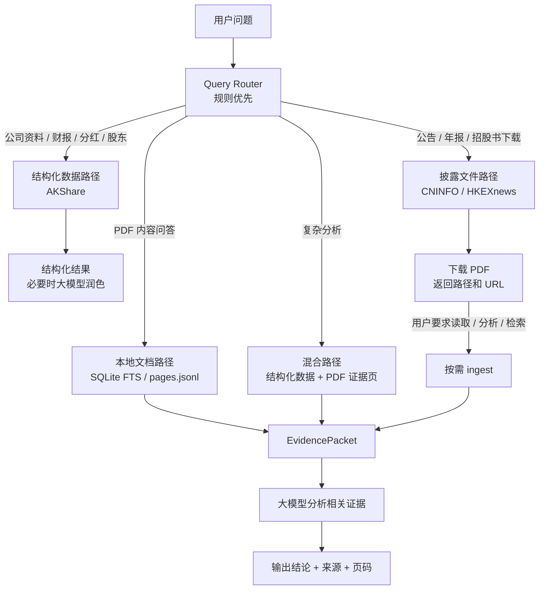
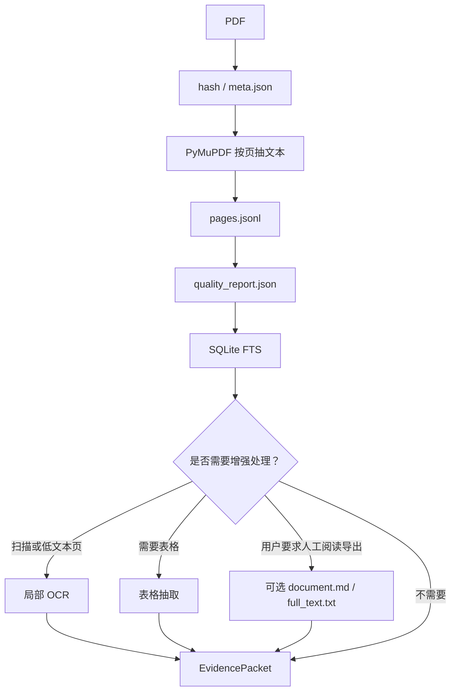

# A3 工作流

相关文档：[README](../README.md) | [A0.文档索引](./A0_DOC_INDEX.md) | [A1.安装使用](./A1_INSTALLATION_AND_USAGE.md) | [A2.本地更新](./A2_UPDATE_LOCAL_INSTALL.md) | [A3.工作流](./A3_WORKFLOW.md) | [A4.MCP函数](./A4_MCP_TOOLS.md) | [B1.PDF Ingest](./B1_PDF_INGEST.md) | [B2.公司数据](./B2_COMPANY_DATA.md) | [B3.HKEX](./B3_HKEX.md) | [B4.招股书](./B4_PROSPECTUS.md) | [C1.测试计划](./C1_TEST_PLAN.md) | [D1.开发计划](./D1_DEVELOPMENT_PLAN_V1_0.md) | [命令示例](../examples/A0_CLAUDE_CODE_COMMANDS.md) | [更新日志](../CHANGELOG.md)

本文说明用户提问后，`ah-disclosure` 应该按什么顺序工作。

## 1. 总体原则

```text
先判断问题类型
再选数据路径
能用结构化数据就先用结构化数据
需要原文证据时再下载或读取 PDF
大模型只读取相关证据，不默认读取全文
```

## 2. 问题路由



## 3. 只下载 PDF 的链路

用户只说“下载年报 / 下载公告 / 下载招股书”时：

```text
识别公司和市场
-> 查询公告列表
-> 找到目标 PDF
-> 下载到 raw/
-> 返回本地路径和来源 URL
```

不会默认执行：

- PyMuPDF 抽文本
- `pages.jsonl`
- `quality_report.json`
- SQLite FTS
- `document.md`
- `full_text.txt`

## 4. 下载并分析的链路

用户说“下载并分析”“告诉我里面某项政策”“摘要年报”时：

```text
下载 PDF
-> ingest_pdf_tool
-> PyMuPDF 按页抽文本
-> 生成 meta.json / pages.jsonl / quality_report.json
-> 写入 SQLite FTS
-> 本地检索相关页
-> 组装 EvidencePacket
-> 大模型只读取 EvidencePacket 并回答
```

## 5. 追问时的链路

如果 PDF 已经下载并解析，后续追问不会重新下载。

```text
读取本地 SQLite FTS
-> 搜索关键词和同义词
-> 必要时读取相邻页
-> 必要时跨年报 / 季报 / 会计政策页交叉验证
-> 大模型组织答案
```

## 6. 关键词检索策略

不能只搜一个关键词。对会计政策、年报解释、财务分析问题，应采用多路径检索：

- 用户原话关键词。
- 中文同义词。
- 英文财报术语。
- 固定章节词，例如 `revenue recognition`、`segment information`、`significant accounting policies`。
- 命中页的前后相邻页。
- MD&A、会计政策、附注和表格之间的交叉验证。

## 7. PDF ingest 流程



## 8. 大模型介入点

本地 Python 负责：

- 下载 PDF。
- 计算 hash。
- 抽页文本。
- 写 JSONL。
- 写 SQLite。
- OCR。
- 表格抽取。
- 检索相关页。

大模型负责：

- 判断用户意图。
- 选择检索策略。
- 根据 EvidencePacket 解释和总结。
- 明确区分原文事实和推断。

