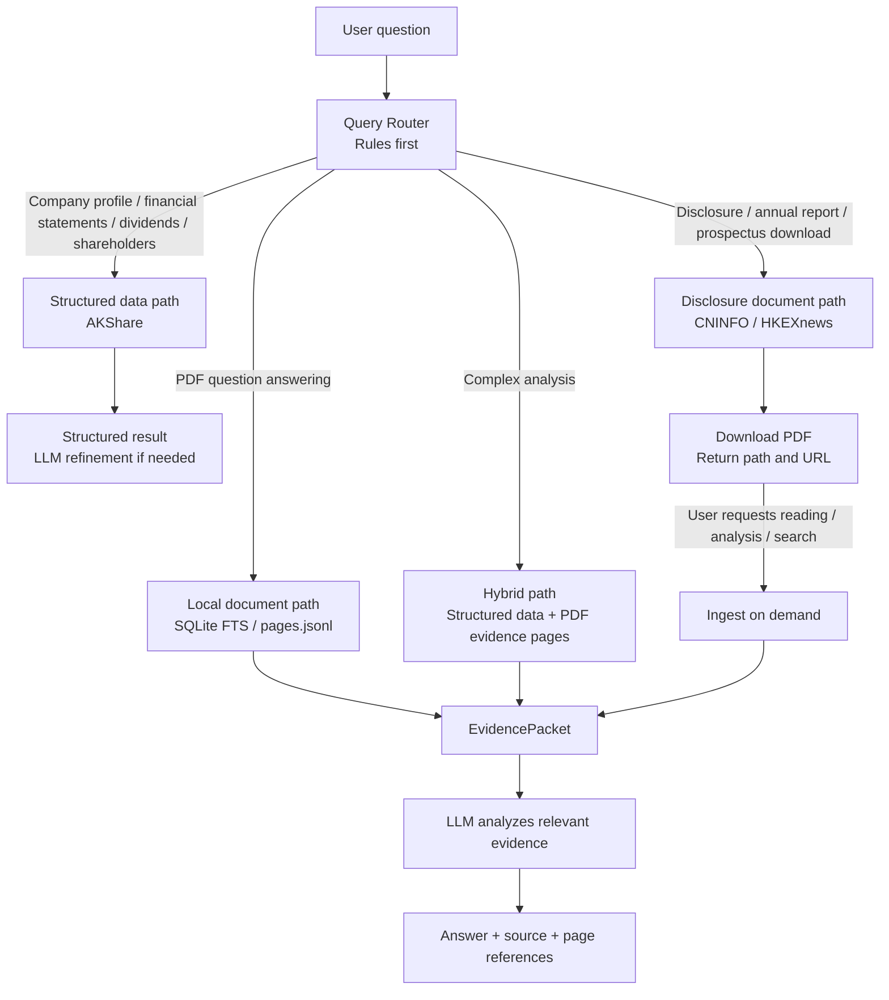
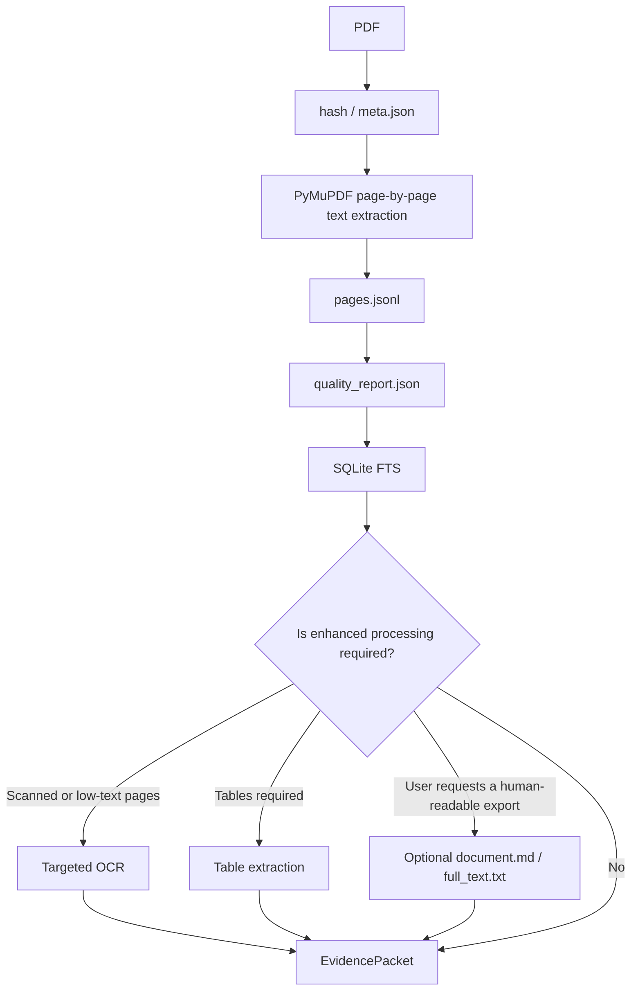

# A3 Workflow

Documentation navigation: [A0 Documentation Index](./A0_DOC_INDEX.md)

This guide explains the sequence in which `ah-disclosure` should operate after a user submits a question.

## 1. General Principles

```text
Classify the question first
Then select the appropriate data path
Prefer structured data when it can answer the question
Check the local source cache before searching for disclosure sources
Download or read the PDF only when primary-source evidence is required
Provide the LLM only with relevant evidence rather than the full document by default
```

## 2. Query Routing



## 3. PDF-Only Download Workflow

When the user asks only to "download the annual report," "download the announcement," or "download the prospectus":

```text
Identify the company and market
-> Query the local source cache
-> Query the official announcement list on a cache miss
-> Select annual report candidates by title priority
-> Download to staging/downloads/
-> Validate annual reports and prospectuses by page count, file size, key English/Chinese sections, company/stock code, and year
-> Move validated files to raw/
-> Delete invalid short announcements, publication notices, or summaries from staging and automatically try the next candidate
-> Move scanned documents or identity anomalies that cannot be assessed reliably to staging/review/ rather than raw/
-> Return the local path and source URL
```

The workflow does not run the following by default:

- PyMuPDF text extraction
- `pages.jsonl`
- `quality_report.json`
- SQLite FTS
- `document.md`
- `full_text.txt`

Completeness and identity validation reads PDF metadata and text in memory without generating the persistent parsing artifacts listed above. If ingest is requested afterward, the pages extracted during validation are reused so the entire PDF is not read twice.

## 4. Download-and-Analyze Workflow

When the user asks to "download and analyze," identify a policy in the document, or summarize an annual report:

```text
ensure_filing_evidence_tool
-> Automatically match a locally ingested document by market, symbol, year, document type, and language
-> If matched, skip source search, download, and completeness scanning without requiring an explicit document_id
-> Otherwise, query the local source cache
-> Query the official source and download to staging when necessary
-> Extract text page by page with PyMuPDF and validate structure and document identity
-> Move the validated file to the official raw directory
-> Ingest when necessary and reuse the pages extracted during validation
-> Generate meta.json / pages.jsonl / quality_report.json
-> Write to SQLite FTS
-> Search relevant pages locally
-> Assemble an EvidencePacket
-> The LLM answers using only the EvidencePacket
```

## 5. Follow-Up Workflow

If the PDF has already been downloaded and ingested, follow-up questions do not trigger another download.

```text
Read the local SQLite FTS index
-> Search keywords and synonyms
-> Read adjacent pages when necessary
-> Cross-check annual reports / interim reports / accounting policy pages when necessary
-> The LLM composes the answer
```

Source discovery supports:

- `prefer_cache=true`: Prefer local data by default.
- `refresh=true`: Ignore the source cache and refresh from the official source.
- `offline=true`: Prohibit remote requests and use only the local cache.

When no annual report year is specified, select the latest version based on an explicit fiscal year in the title. The announcement date is used only to rank candidates within the same fiscal year and cannot replace the report year. A title in the form `Fiscal Year YYYY Annual Report` is treated as an exact annual report title. If multiple candidates for the latest year still have equal scores, ask the user to choose.

`execution_info` separately reports document-cache, source-cache, PDF-cache, and ingest-cache hits. Its `timings_ms` field breaks down source discovery, download, completeness validation, ingest, evidence retrieval, and total elapsed time.

## 6. Keyword Search Strategy

Do not rely on a single keyword. For accounting policies, annual report explanations, and financial analysis questions, use multiple retrieval paths:

- The user's original terminology.
- Chinese synonyms.
- English financial reporting terminology.
- Standard section terms such as `revenue recognition`, `segment information`, and `significant accounting policies`.
- Pages adjacent to a hit.
- Cross-checks among MD&A, accounting policies, notes, and tables.

## 7. PDF Ingest Workflow



## 8. LLM Responsibilities and Orchestration

- Kit code: Download, parse, perform bounded retrieval, validate evidence IDs and scope, execute deterministic Decimal calculations, and enforce result gates.
- Planning LLM: Understand the user's question, decompose it into independently verifiable claims, and define retrieval expressions, dependencies, and calculation intent without answering the user directly.
- Parallel worker / subagent: Review only one assigned claim using its permitted evidence IDs and return one structured review result. It must not answer the user, expand the document or evidence scope, or perform calculations without citations.
- Orchestrator LLM: Resolve period, unit, scope, and interpretation conflicts across claims; design evidence-linked calculations; and merge one validated review result per claim. The orchestrator may generate the final answer only after the Kit validates the merged result.

Dynamic analysis workflow:

```text
prepare_llm_analysis_tool returns responsibility_contract
-> The planning LLM generates analysis_plan
-> Claims may define depends_on_claim_ids / review_role / worker_preference
-> execute_llm_analysis_plan_tool retrieves evidence and returns provider-neutral orchestration.review_batches
-> Hosts that support subagents launch independent workers in parallel for can_run_in_parallel batches
-> Hosts without subagent support review the review_batches sequentially
-> The orchestrator LLM merges review results and resolves conflicts
-> continue_llm_analysis_tool / verify_analysis_calculations_tool validates the result through the Kit
-> After validation passes, the orchestrator LLM answers the user
```

`depends_on_claim_ids` controls batch order; `review_role` describes the recommended specialist review role; and `worker_preference` may be `auto`, `parallel_worker`, or `orchestrator`. Parallel execution is a host capability. It does not change the protocol or relax evidence boundaries.

Batch preparation uses `ah-disclosure batch prepare` to run the same deterministic workflow and performs only identity resolution, source discovery, download, validation, and ingest. Exact duplicate tasks reuse the first result, while alias tasks that resolve to the same file are processed sequentially. EvidencePacket retrieval, analysis, valuation, and writing are performed later on demand.

---
**Document created:** 2026-07-03 19:31

**Last modified:** 2026-07-23 17:36

**Last modified model:** Not set (`ANTHROPIC_MODEL` is empty)
