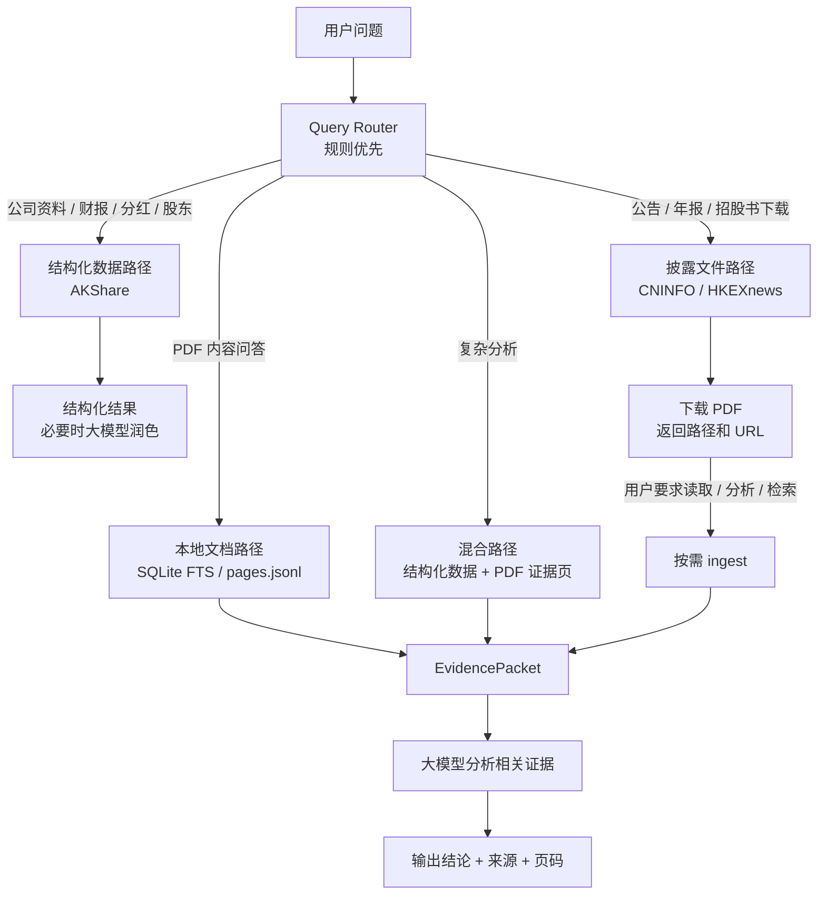
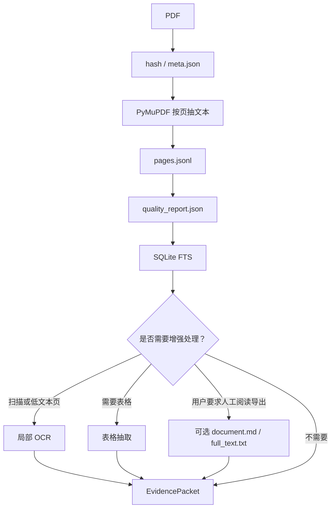

# A3 工作流

文档导航：[A0 文档索引](./A0_DOC_INDEX.md)

本文说明用户提问后，`ah-disclosure` 应该按什么顺序工作。

## 1. 总体原则

```text
先判断问题类型
再选数据路径
能用结构化数据就先用结构化数据
查披露来源时先查本地来源缓存
需要原文证据时再下载或读取 PDF
大模型只读取相关证据，不默认读取全文
```

## 2. 问题路由



## 3. 只下载 PDF 的链路

用户只说“下载年报 / 下载公告 / 下载招股书”时：

```text
识别公司和市场
-> 查询本地来源缓存
-> 缓存未命中时查询官方公告列表
-> 按标题优先级选择年报候选
-> 下载到 staging/downloads/
-> 年报和招股书按页数、文件大小、中英文关键章节及公司/股票代码/年度校验
-> 校验通过后移动到 raw/
-> 短公告、发布通知或摘要不合格时从暂存区删除并自动尝试下一候选
-> 无法可靠判断的扫描件或身份异常文件移动到 staging/review/，不进入 raw/
-> 返回本地路径和来源 URL
```

不会默认执行：

- PyMuPDF 抽文本
- `pages.jsonl`
- `quality_report.json`
- SQLite FTS
- `document.md`
- `full_text.txt`

完整性和身份校验只在内存中读取 PDF 元数据和文本，不生成上述持久化解析产物。如果随后需要 ingest，同一次抽取的页面会直接复用，不会为校验和解析重复读取整本 PDF。

## 4. 下载并分析的链路

用户说“下载并分析”“告诉我里面某项政策”“摘要年报”时：

```text
ensure_filing_evidence_tool
-> 根据市场、代码、年份、文档类型和语言自动匹配本地已解析文档
-> 命中时无需显式提供 document_id，跳过来源搜索、下载和完整性扫描
-> 否则查询本地来源缓存
-> 必要时查询官方来源并下载到暂存区
-> PyMuPDF 按页抽文本并完成结构及身份校验
-> 校验通过后移动到正式 raw 目录
-> 必要时 ingest，并复用刚才抽取的页面
-> 生成 meta.json / pages.jsonl / quality_report.json
-> 写入 SQLite FTS
-> 本地检索相关页
-> 组装 EvidencePacket
-> 大模型只读取 EvidencePacket 并回答
```

## 5. 追问时的链路

如果 PDF 已经下载并解析，后续追问不会重新下载。

```text
读取本地 SQLite FTS
-> 搜索关键词和同义词
-> 必要时读取相邻页
-> 必要时跨年报 / 季报 / 会计政策页交叉验证
-> 大模型组织答案
```

来源查询支持：

- `prefer_cache=true`：默认本地优先。
- `refresh=true`：忽略来源缓存并刷新官方来源。
- `offline=true`：禁止远程请求，仅使用本地缓存。

年报未指定年度时，按标题中的明确财政年度选择最新版本；公告发布日期仅作为同年度排序依据，不能代替报告年度。`Fiscal Year YYYY Annual Report` 视为精确年报标题。同一最新年度仍有多个同分候选时返回用户确认。

`execution_info` 会分别披露文档缓存、来源缓存、PDF 缓存和 ingest 缓存是否命中，并在 `timings_ms` 中拆分来源查询、下载、完整性校验、ingest、证据检索和总耗时。

## 6. 关键词检索策略

不能只搜一个关键词。对会计政策、年报解释、财务分析问题，应采用多路径检索：

- 用户原话关键词。
- 中文同义词。
- 英文财报术语。
- 固定章节词，例如 `revenue recognition`、`segment information`、`significant accounting policies`。
- 命中页的前后相邻页。
- MD&A、会计政策、附注和表格之间的交叉验证。

## 7. PDF ingest 流程



## 8. LLM 分工与编排

- Kit 代码：下载、解析、受限检索、证据 ID 与范围校验、确定性 Decimal 计算及结果门禁。
- 规划 LLM：理解用户问题，拆分可验证 claims，设置检索表达、依赖关系和计算意图，不直接回答用户。
- parallel worker / subagent：仅复核分配的单个 claim 及允许的证据 ID，返回一条结构化审阅结果；不得回答用户、扩大文档或证据范围，也不得执行无引用计算。
- 主编排 LLM：处理跨 claim 的期间、单位、口径和解释冲突，设计证据关联计算，合并每个 claim 的唯一审阅结果；Kit 校验合并结果后，主编排 LLM 才生成最终答案。

动态分析流程：

```text
prepare_llm_analysis_tool 返回 responsibility_contract
-> 规划 LLM 生成 analysis_plan
-> claims 可设置 depends_on_claim_ids / review_role / worker_preference
-> execute_llm_analysis_plan_tool 检索证据并返回 provider-neutral orchestration.review_batches
-> 支持 subagent 的宿主按 can_run_in_parallel 并行启动独立 worker
-> 不支持 subagent 的宿主按 review_batches 顺序串行复核
-> 主编排 LLM 合并审阅结果并处理冲突
-> continue_llm_analysis_tool / verify_analysis_calculations_tool 由 Kit 校验
-> 校验通过后主编排 LLM 回答用户
```

`depends_on_claim_ids` 决定批次先后；`review_role` 描述建议的专业复核角色；`worker_preference` 可为 `auto`、`parallel_worker` 或 `orchestrator`。并行是宿主执行能力，不改变协议，也不放宽证据边界。

批量准备使用`ah-disclosure batch prepare`执行相同的确定性链路，只完成身份解析、来源定位、下载、校验和ingest。完全重复任务复用首次结果，解析到同一文件的别名任务串行处理；EvidencePacket、分析、估值和写作在后续按需执行。

